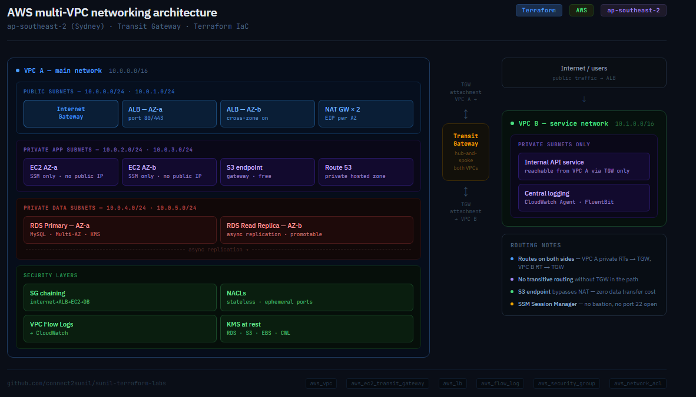

# AWS Multi-VPC Networking — Terraform

A production-pattern AWS networking project built entirely in Terraform.
Two VPCs connected via Transit Gateway, layered security, and full traffic
visibility through VPC Flow Logs. Deployed in ap-southeast-2 (Sydney).

---

## Architecture




## What's built

**VPC A — main network (10.0.0.0/16)**
- 2 public subnets across 2 AZs — ALB and NAT Gateways
- 2 private subnets across 2 AZs — application tier
- Internet Gateway with default route on public route table
- NAT Gateway per AZ — private subnets get outbound internet, no inbound
- S3 gateway endpoint — private subnets reach S3 without NAT charges
- Route 53 private hosted zone for internal DNS
- VPC Flow Logs → CloudWatch Logs

**VPC B — service network (10.1.0.0/16)**
- Private subnets only — no IGW, no public access
- Reachable from VPC A through Transit Gateway only

**Transit Gateway**
- Hub-and-spoke model connecting VPC A and VPC B
- Routes added in both VPCs — traffic flows both directions
- TGW ENIs placed in private subnets (correct pattern)

**Security layers**
- Tiered security groups: internet → ALB SG → app SG → db SG (SG chaining)
- NACLs with explicit ephemeral port rules on both inbound and outbound
- No public IPs on private instances
- No hardcoded secrets — all values via variables

**Load balancer**
- Application Load Balancer in public subnets
- Target group pointing to private EC2 app tier
- Health checks configured


## File structure
.
├── providers.tf       # AWS provider, region, default tags
├── variables.tf       # All input variables declared here
├── main.tf            # VPC A — subnets, IGW, NAT GW, route tables
├── vpc_b.tf           # VPC B + Transit Gateway + cross-VPC routes
├── security.tf        # Security groups, NACLs
├── alb.tf             # Application Load Balancer, target group, listener
├── flow_logs.tf       # VPC Flow Logs, CloudWatch log group, IAM role
└── outputs.tf         # VPC IDs, subnet IDs, ALB DNS name

---

## How to deploy

```bash
# 1. Clone the repo
git clone https://github.com/connect2sunil/sunil-terraform-labs.git
cd sunil-terraform-labs

# 2. Create your tfvars file (not committed — see .gitignore)
cp terraform.tfvars.example terraform.tfvars
# Edit terraform.tfvars with your values

# 3. Initialise and deploy
terraform init
terraform plan
terraform apply
```

> **Cost note:** NAT Gateways cost ~$0.059/hr each. Two are deployed by default
> (one per AZ). Destroy after each session if using for learning:
> `terraform destroy -target=aws_nat_gateway.az_a -target=aws_nat_gateway.az_b`

---

## Key Terraform resources

`aws_vpc` · `aws_subnet` · `aws_internet_gateway` · `aws_nat_gateway` ·
`aws_eip` · `aws_route_table` · `aws_route_table_association` · `aws_route` ·
`aws_ec2_transit_gateway` · `aws_ec2_transit_gateway_vpc_attachment` ·
`aws_security_group` · `aws_security_group_rule` · `aws_network_acl` ·
`aws_network_acl_rule` · `aws_flow_log` · `aws_cloudwatch_log_group` ·
`aws_iam_role` · `aws_lb` · `aws_lb_target_group` · `aws_lb_listener`

---

## Requirements

- Terraform >= 1.6.0
- AWS CLI configured (`aws configure`)
- AWS provider ~> 5.0
- Region: ap-southeast-2 (Sydney) — change in terraform.tfvars

